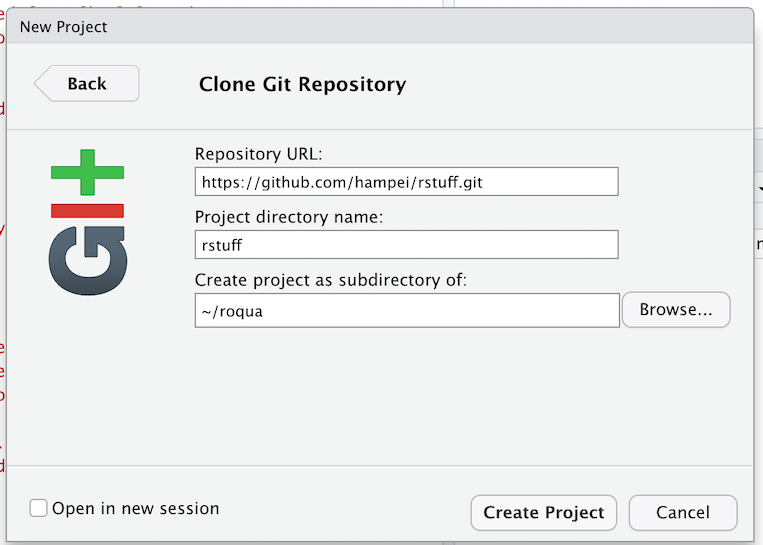
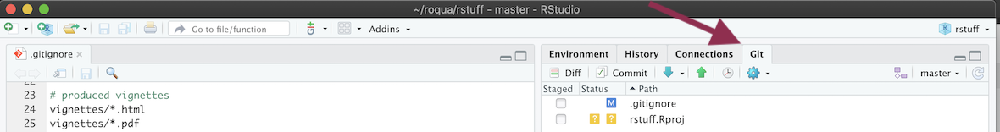
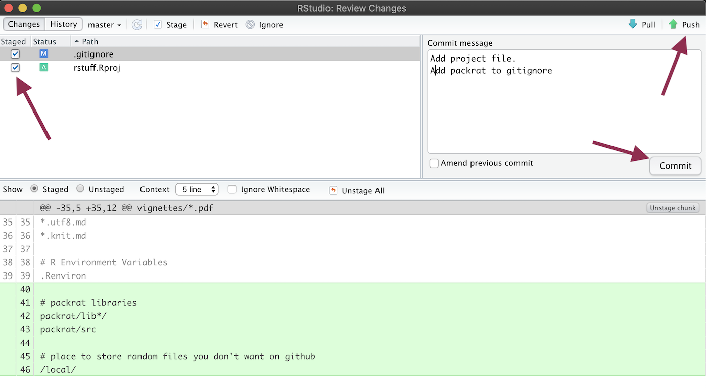
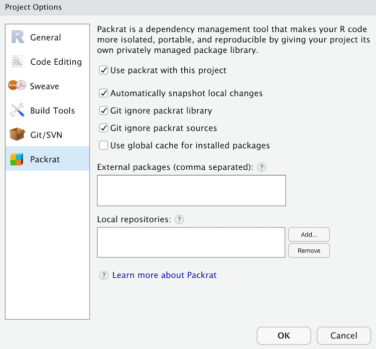

## Create a repository

* Go to github.com
* Login or Sign up for an account
* Click on the New button next Repositories.
* Add an R .gitignore file
* Add a license
* "Create repository"
* "Clone or download" > "use HTTPS" > copy url


## Install basics

* Install git: https://happygitwithr.com/install-git.html#install-git

## Checkout repository

* Open RStudio
* File > New Project  
* Version Control > Git
* paste github url
* select a parent directory
* "Create Project"



## First commit

* Open the git panel on the right 
* click commit
* select both files
* enter a commit message
* press commit
* press push
* enter github details



## Install packrat

* Back on the main screen open the Packages panel
* Click on "Packrat"
* Select "Use packrat with this project"
* Ok
* If a popup appears to install extra pacakges say yes.
* Select the options you want
* press ok
* commit all changes files and push, only these files should be visible:
  ```
  new file:   .Rprofile
  modified:   .gitignore
  new file:   packrat/init.R
  new file:   packrat/packrat.lock
  new file:   packrat/packrat.opts
  ```



## Install rmarkdown

* Install the `rmarkdown` package.
* create a new folder `site` and enter it
* "File" > "New File" > "R Markdown..."
* press ok and save it to `site/index.Rmd`
* Press the `Knit` button at the top of the file to test.
* Add site/_site.yml with
  ```
  name: "Cool R stuff"
  output_dir: "html"
  navbar:
    title: "Cool R stuff"
    left:
      - text: "Index"
        href: index.html
      - text: "Install"
        href: install.html
  output:
     html_document:
        theme: cosmo
  exclude: ["public"]
  ```
* add `/site/html` to .gitignore file so the generated html is not added to git.
